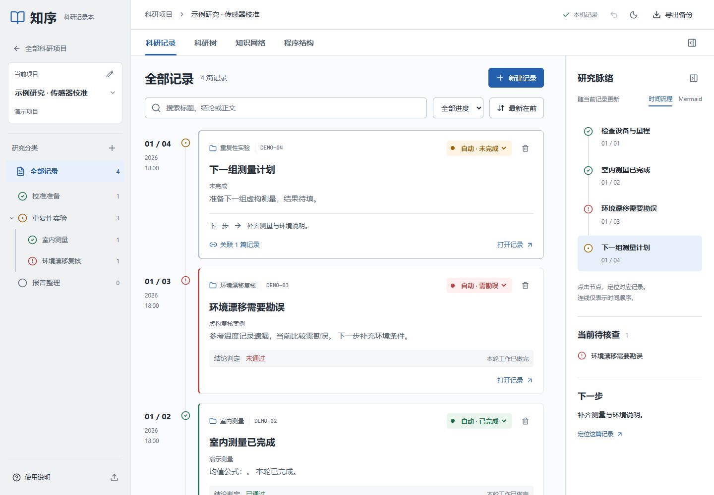
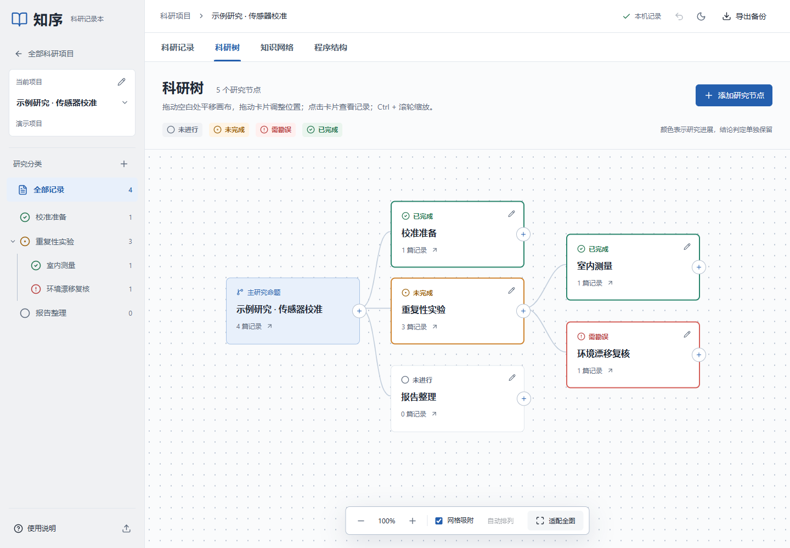
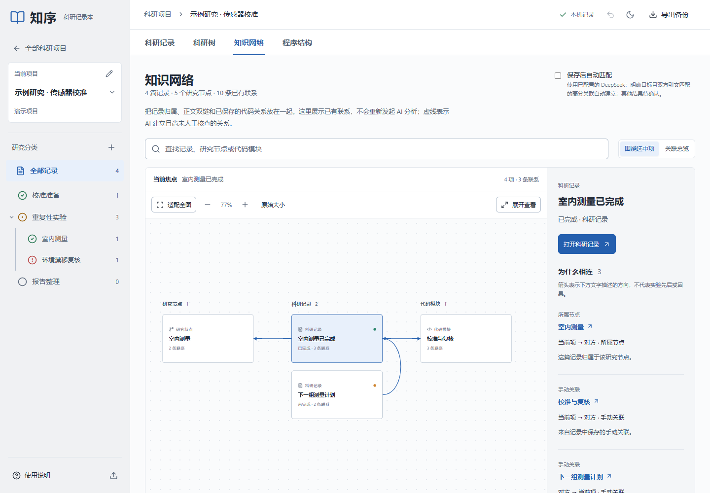

# 知序 · 科研记录本（开源版）

帮助研究者自己组织研究问题、实验过程和结论的本地记录工具。记录、科研树、知识网络和代码架构在同一个项目中互相连接。

[MIT](LICENSE) · [使用说明](docs/AI与双链优化-0.3.0.md) · [问题反馈](https://github.com/junru-a/zhixu-notebook/issues)

这是独立的开源版 `0.3.0-oss.1`。源码不包含作者的私人 API Key、实验记录、备份、旧原型或真实记录截图；内置演示内容完全虚构。

## 预览

以下截图全部来自虚构演示项目。







## 功能

- 项目与父子研究节点；四色进展与科学判定分开记录。
- 时间顺序卡片，Markdown、LaTeX、Mermaid 阅读与编辑。
- 科研树自由拖动、网格吸附、空白平移、滚轮浏览和全图适配。
- `[[记录标题]]` 双向链接；知识网络显示研究节点、记录和代码模块。
- 多目录代码扫描；可选 DeepSeek 架构分析、连线注释和记录关联建议。
- Windows 桌面窗口、系统托盘、原子保存、上一份快照与 JSON 导入导出。

## 安装与启动

Windows 用户可从 [Releases](https://github.com/junru-a/zhixu-notebook/releases) 下载安装包；首个公开版本为预览版，说明见 [发布说明](docs/RELEASE_NOTES.md)。安装包随附 SHA-256 校验值。

### 从源码运行

需要 Node.js 22.12 或更高版本和 npm。Windows 10/11 x64 为桌面版当前目标；浏览器开发方式也可在其他系统使用，桌面安装包暂仅提供 Windows 构建配置。

```sh
npm --prefix app ci
npm run dev
```

浏览器打开 **http://localhost:5290/**。首次启动为空项目，点击“打开演示项目”可创建一份虚构示例。请固定浏览器和访问地址，浏览器本地存储按来源隔离。

桌面开发与打包：

```sh
npm --prefix desktop ci
npm run desktop
# Windows 安装包
npm run desktop:dist
```

生成的安装包位于 `desktop/release/`；本源码交付不包含安装包。Windows 可双击 `启动浏览器版.vbs` / `停止浏览器版.vbs`。桌面启动器用于已经安装的开源版。

## 可选 AI 配置

桌面版：进入右上角软件设置，填入自己的 API Key 和账户支持的模型名称。密钥通过 Windows 系统加密保存，不进入记录备份。

浏览器版：将 `app/.env.example` 复制为 `app/.env.local`，填入自己的 `DEEPSEEK_API_KEY`，按账户可用模型修改 `DEEPSEEK_MODEL`，然后重新启动服务。密钥只供本机服务使用，不能以 `VITE_` 前缀写入前端。未配置密钥也可使用全部本地记录功能。

程序架构分析前可选择发送的文件与片段；保存后的记录匹配可在项目设置中关闭。启用 AI 后所选源码、记录片段和上下文会发送到 DeepSeek，调用按账户计费。请自行确认发送范围；自动遮盖常见密钥不保证识别全部敏感信息。

## 隔离与备份

- 开源桌面版使用 `%APPDATA%/ZhixuNotebookOpenSource/` 保存数据和加密配置。
- 产品名、安装标识、桌面快捷方式、浏览器端口和本地存储键均独立。
- 不自动迁入其他版本的配置或记录；跨版本迁移须自行导出、导入。
- 关闭窗口会隐藏到托盘；右键托盘选择退出才结束进程。
- `npm run preview` 仅验证构建结果，不能代替正式多用户后端。

不要提交自己的 `.env.local`、数据文件夹、记录备份、截图、日志或签名证书。

## 检查与贡献

```sh
npm run privacy:check
npm test
npm run desktop:test
npm run build
```

功能边界、发布前事项见 [开源检查报告](docs/OPEN_SOURCE_REVIEW.md)。参与方式见 [贡献说明](CONTRIBUTING.md)，隐私与漏洞报告见 [安全说明](SECURITY.md)，依赖与参考见 [第三方说明](THIRD_PARTY_NOTICES.md)。

AI 架构结果来自有限片段，未提供经标注集测量的准确率；需检查引文、推测与人工核查状态。当前还没有完整语法树、运行时调用追踪、协同编辑、云同步或跨设备自动同步。


0.3.0 使用方式与验证边界见 [AI 与双链优化](docs/AI与双链优化-0.3.0.md)。

## 许可证

[MIT](LICENSE) · Copyright (c) 2026 junru-a and contributors。第三方依赖按其各自许可证分发。
